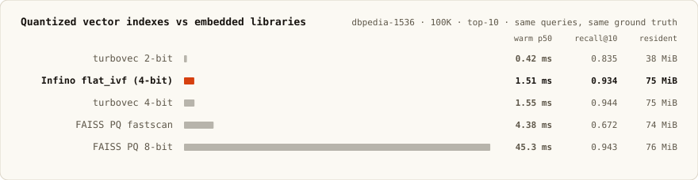
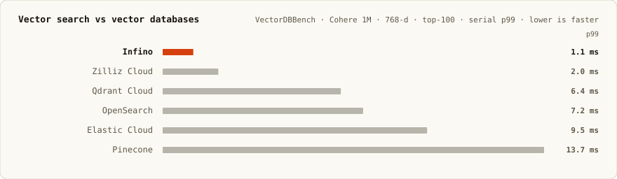
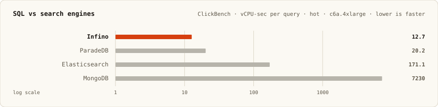
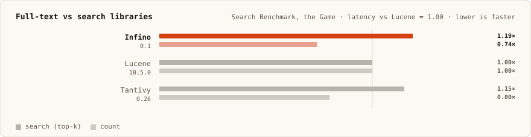

# RetrievalBench

[](LICENSE)
[](LICENSE-CC-BY-4.0)

[Infino's](https://github.com/infino-ai/infino) external benchmark harness.

## The benchmarks

| Benchmark | Comparators | Scale | Where |
|---|---|---|---|
| [Embedded vector libraries](#embedded-vector-libraries) | turbovec, FAISS | 100K / 1M | [`benches/comparison/`](benches/comparison/) → [`results/inprocess/`](results/inprocess/) |
| [Vector databases](#vector-databases) | VectorDBBench's bundled peers | 1M / 10M | [live viewer](https://vdbbench-viewer-q6unoyyhua-uc.a.run.app) |
| [SQL on ClickBench](#sql-on-clickbench) | the public leaderboard | 100M rows | [`clickbench/`](clickbench/README.md) |
| [Full-text at Wikipedia scale](#full-text-at-wikipedia-scale) | Tantivy, Lucene, … | fixed Wikipedia corpus | [`search-benchmark/`](search-benchmark/README.md) |

## Embedded vector libraries

Every engine in one process: same queries, brute-force exact ground truth,
each library reached through its own public API. Infino's row is the shipped
`flat_ivf` mode — a table built by the normal lifecycle (`append` → `commit`
→ `optimize()`), serving the resident 4-bit plane that one config line
selects.

Measured at dbpedia-1536, 100K rows, top-10:



Reproduce that table with plain `cargo bench` (the corpus downloads once):

```sh
printf 'vector:\n  search_mode: flat_ivf\n' > infino.yaml
INFINO_BENCH_SUPERTABLE_DOCS=100000 \
  cargo bench -- vector-codec \
  corpus=hf:KShivendu/dbpedia-entities-openai-1M corpus-dir=./corpora
```

Add `--features faiss` (after `scripts/build_faiss.sh`, which builds the
exact FAISS source faiss-rs bundles, with `-march=native` — without it
FastScan silently runs scalar) for the FAISS rows. Remove `infino.yaml`
before running other benchmarks; everything else measures shipped defaults.

To regenerate the committed results — every benchmark for one corpus,
both thread modes, publisher refusing a dirty tree and stamping
host/commit/command into `run.json`:

```sh
./scripts/publish_results.sh dbpedia-1536-100k 100000 \
  hf:KShivendu/dbpedia-entities-openai-1M ./corpora
```

Selection grammar matches Infino's own bench suite:
`cargo bench -- [tier] [modality] [phase ...]`, plus the `vector-codec` and
`table-writes` selections. Scale knobs: `INFINO_BENCH_SUPERFILE_DOCS`,
`INFINO_BENCH_SUPERTABLE_DOCS`, `INFINO_BENCH_STORE`. Engine behavior is
YAML-only; environment variables never change it.

## Vector databases



Runs through [VectorDBBench](https://github.com/zilliztech/VectorDBBench) via
[our client](https://github.com/infino-ai/VectorDBBench/tree/main/vectordb_bench/backend/clients/infino);
the public leaderboard is at
[zilliz.com/vdbbench-leaderboard](https://zilliz.com/vdbbench-leaderboard?dataset=vectorSearch).
To run it yourself, the same way as any engine on that board:

```sh
git clone https://github.com/infino-ai/VectorDBBench && cd VectorDBBench
pip install -e .
init_bench
```

## SQL on ClickBench




Runs through [our port](https://github.com/infino-ai/clickbench/tree/add-infino/infino)
of the public [ClickBench](https://benchmark.clickhouse.com/) suite.
Headline on c8g.metal-48xl: hot sum **6.45 s**, geomean **0.090** — #17 of
60 systems. Details and per-machine results: [`clickbench/`](clickbench/README.md).

## Full-text at Wikipedia scale



[Search Benchmark, the Game](https://tantivy-search.github.io/bench/) via
[our fork](https://github.com/infino-ai/search-benchmark-game) —
single-threaded, full-Wikipedia, HTTP-timed, so not comparable to the
in-process tables. See [`search-benchmark/README.md`](search-benchmark/README.md).


## Hardware

| Suite | Machine |
|---|---|
| In-process (embedded, cost) | recorded in each run's `results/inprocess/<run>/run.json` (memory figures recorded on Linux) |
| Vector databases | cloud VM, instance type recorded per run |
| ClickBench | `c6a.4xlarge` (reference) and `c8g.metal-48xl` (leaderboard) |
| Full-text | AWS `c7i.2xlarge` |

## Contributing

Bug reports, better peer-engine configurations, and additional comparators are
all welcome. See [CONTRIBUTING.md](CONTRIBUTING.md) for setup, how results get
published, and the standards a published number is held to.

If you maintain an engine measured here and think we've configured it unfairly
or read its API wrongly, please
[open an issue](https://github.com/infino-ai/retrievalbench/issues). We'd
rather fix a number than defend it.

Participation is governed by our [Code of Conduct](CODE_OF_CONDUCT.md).
Security issues go through [SECURITY.md](SECURITY.md), not the public issue
tracker.

## License

This repository is dual-licensed:

| What | License |
|---|---|
| Harness code — `benches/`, `scripts/`, `annbench/`, `vdbbench-viewer/`, `.github/` | [Apache-2.0](LICENSE) |
| Published results and figures — `results/`, `docs/assets/`, the tables above | [CC BY 4.0](LICENSE-CC-BY-4.0) |

So you can reuse the harness under Apache-2.0, and you can quote, chart, or
republish our numbers anywhere — including in a comparison that disagrees with
ours — as long as you attribute Infino AI, Inc. and link back here. Please
cite the run: each `results/inprocess/<run>/run.json` records the host, the
engine commit, and the exact command.

Contributions are accepted under the
[Individual Contributor License Agreement](cla/ICLA.md); the `license/cla`
check on your first pull request walks you through signing it.

The engines measured here are the property of their respective authors and
carry their own licenses.
